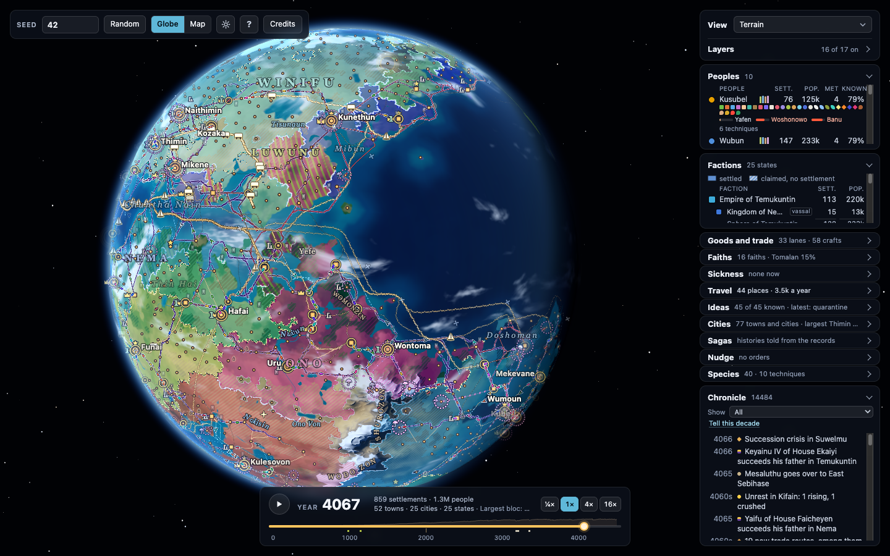

# worldseed

A deterministic procedural planet and civilisation simulator that runs entirely
in the browser. Give it a seed, and it generates a planet (plate tectonics,
elevation, climate, rivers, biomes) and then simulates roughly 2000 years of
emergent settlement history on top of it: founding, migration, farming, trade,
roads, ports, dams, and the rise and fall of towns and cities. There is no
backend, no LLM, and no corpus of training data — everything is generated from
the seed by code in this repository.

Live at [ryanmye.github.io/worldseed](https://ryanmye.github.io/worldseed/).



*Seed 42 in the year 4067: 25 states, 25 cities and 33 long-distance lanes, 1.3 million people.*

## Running it

```
npm install
npm run dev
```

Then open the URL Vite prints (typically `http://localhost:5173`).

Other useful commands:

```
npm test         # run the test suite (vitest)
npm run typecheck
npm run build    # type-check and produce a production build with vite
```

## A short tour

- **Seed**: the box in the top-left sets the planet's seed; pressing Enter (or
  blurring the field) regenerates the world. There is also a random-seed
  button. The seed is reflected in the URL as `?seed=<n>`, so a URL fully
  determines the planet.
- **Timeline**: once a world loads, its history is simulated in the
  background and a timeline panel lets you play, pause, and scrub through the
  ~2000 simulated years, watching settlements found, grow, trade, and
  sometimes get abandoned.
- **Layer toggles**: panels let you show or hide rivers, clouds, settlement
  markers, migration journeys, farmland, structures (ports/dams), 3D building
  models, trade routes, and roads.
- **View modes**: the globe can be shown in several modes (e.g. terrain,
  elevation, population, and other data layers) via a view-mode control.
- **Sun control**: a panel lets you fix the sun's position, have it follow the
  camera, or let it move; you can also drag it directly on the globe.
- **Quality setting**: a quality control (high/balanced/low) trades render
  quality for performance.
- **Clicking a settlement**: clicking (or tapping) a settlement opens an
  inspector with details about it; hovering shows a quick terrain/settlement
  readout.

### URL parameters (confirmed in `src/main.ts`)

`seed`, `view`, `spin`, `lon`, `lat`, `az`, `dist`, `clouds`, `rivers`, `sub`,
`year`, `play`, `select`, `markers`, `journeys`, `land`, `structures`,
`models`, `trade`, `roads`, `tilt`, `sun`, `sunlon`, `sunlat`, `quality`,
`bake`, `perf`.

## Architecture

- **`src/contract.ts`** is the boundary between the simulation and everything
  else: it defines the `World` and `History` data types and the
  `generateWorld` / `simulateHistory` function signatures. Neither the sim nor
  the renderer imports the other directly — only through this contract.
- **`src/sim`** is the planet generator (plates, elevation, erosion, climate,
  rivers, biomes). **`src/sim/history`** is the yearly civilisation
  simulation (population, migration, land use, trade, structures). Both run
  off the main thread, inside a Web Worker (**`src/worker.ts`**), which posts
  the generated world back first and the simulated history second so the
  globe appears before history finishes computing.
- **`src/render`** builds the Three.js globe, atmosphere, rivers, clouds, and
  the close-up 3D settlement dioramas (`src/render/dioramas`).
- **`src/ui`** contains the DOM panels: the seed/overlay bar, timeline,
  settlement inspector, chronicle, trade panel, and sun panel.

### Determinism

The simulation is required to be deterministic in its inputs (seed and
options): every subsystem draws from its own named RNG sub-stream, derived
from the world seed, so adding random draws to one subsystem never shifts the
numbers another subsystem sees (see `src/sim/rng.ts`). The simulation code
does not use `Math.random`; it only uses seeded RNG streams and sticks to
basic arithmetic (`+ - * / sqrt`, no `exp`/`sin`/`pow`) so results are
bit-identical across JS engines.

## Licence

GPL-3.0. See [LICENSE](LICENSE).

## Asset credits

The 3D building/ship models used by the diorama layer (`src/render/dioramas/`)
are CC0 (public domain): the KayKit Medieval Hexagon Pack, and Kenney's Pirate
Kit and Fantasy Town Kit. Only a small subset of each pack is shipped, repacked
into `.glb` files with textures baked into vertex colours. See
[`public/models/CREDITS.md`](public/models/CREDITS.md) for the full per-file
attribution and license details.
